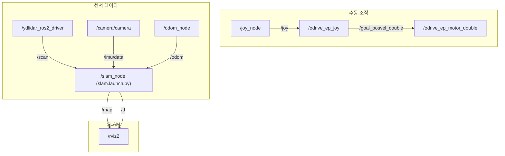
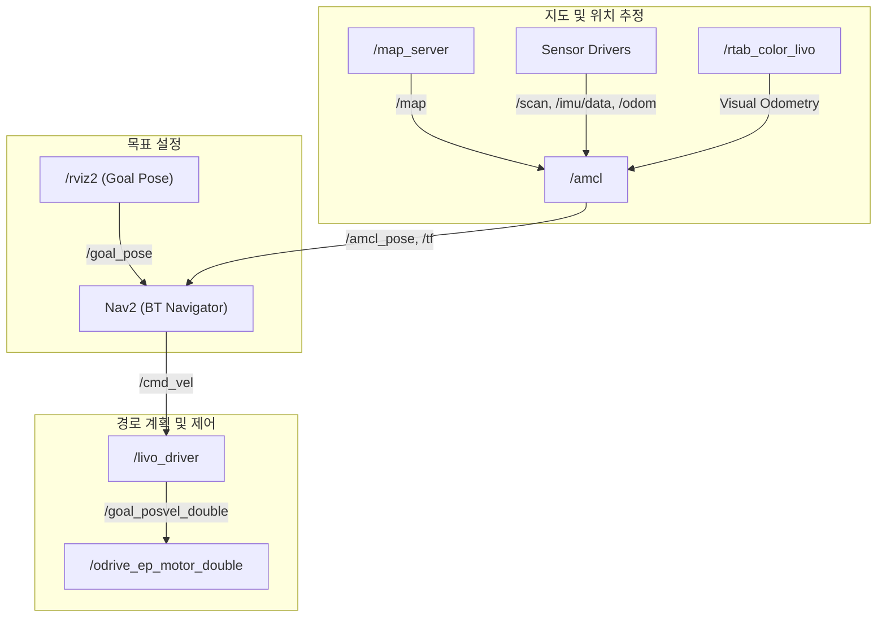

# MOBI 로봇 동작 분석 (SLAM & Navigation)

이 문서는 \*\*MOBI 로봇의 SLAM(지도 생성 및 동시적 위치 추정)\*\*과 **Navigation(자율 주행)** 기능의 동작 방식을 분석하고 설명합니다. 각 기능은 제공된 런치 파일을 기반으로 분석되었습니다.

-----

## 1\. SLAM (Simultaneous Localization and Mapping) 분석

**SLAM 모드**는 로봇이 미지의 환경을 탐험하며 실시간으로 지도를 생성하고, 그 지도 내에서 자신의 위치를 추정하는 기능입니다.

### 1.1. 실행 명령어

```bash
# 1. 센서 및 기본 오도메트리 실행
ros2 launch livo_bringup livo_odom.launch.py

# 2. 모터 드라이버 및 조이스틱 제어 노드 실행
ros2 launch odrive_ep_pkg odrive_ep.launch.py
ros2 run joy joy_node

# 3. SLAM 알고리즘 실행
ros2 launch livo_navigation slam.launch.py rviz:=true sim:=false
```

### 1.2. 동작 흐름도 (ASCII)

```text
+-------------------+      +-----------------+      +-----------------------+
|  사용자 (조이스틱)  |----->|     joy_node    |----->| odrive_ep_joy         |
+-------------------+      +-----------------+      +-----------------------+
                                   |                       |
                                   v                       v
                              /joy (topic)           /goal_posvel_double (topic)
                                   |                       |
                                   v                       v
                          +-----------------------+      +-----------------------+
                          | odrive_ep_motor_double|      |    로봇 구동 (모터)     |
                          +-----------------------+      +-----------------------+
                                   ^
                                   |
+---------------------+            |            +-----------------------+
| YDLiDAR (/scan)     |------------+------------>|       SLAM Node       |
+---------------------+                         | (slam.launch.py)      |
                                   |            +-----------------------+
+---------------------+            |            |           |           |
| Realsense (/imu/data)|------------+------------> /map (topic)  /tf (map->odom)
+---------------------+                         |           |           |
                                   |            +-----------------------+
+---------------------+            |                       |
| odom_node (/odom, /tf)|------------+-----------------------+
+---------------------+
                                   |
                                   v
                          +-------------------+
                          |       RViz        |
                          +-------------------+
```

### 1.3. RQT 그래프 (ASCII)

```text
+----------------+      +-------------------+      +----------------------+
|  /joy_node     |----->|  /odrive_ep_joy   |----->| /odrive_ep_motor_double|
+----------------+  /joy  +-------------------+  /goal_posvel_double  +----------------------+
  (수동 조작)

+---------------------+      +---------------------+
| /ydlidar_ros2_driver|----->|                     |
+---------------------+  /scan |                     |
                          |     |                     |
+---------------------+   |     |      /slam_node     |
| /camera/camera      |----->|   SLAM 노드         |
+---------------------+  /imu/data | (slam.launch.py)    |
                          |     |                     |
+---------------------+   |     |                     |
| /odom_node          |----->|                     |
+---------------------+  /odom +---------------------+
                                   |        |
                                   |        | /map
                                   v        v /tf
                                +---------+
                                |  /rviz2 |
                                +---------+
```

RQT 그래프 (Mermaid)


### 1.4. 단계별 설명

1.  **센서/구동계 활성화**: `livo_odom.launch.py`가 실행되어 Lidar, Realsense 카메라, IMU 센서 및 모터 엔코더를 이용한 기본 **오도메트리 노드(`odom_node`)가 활성화**됩니다.
2.  **수동 조작 준비**: `joy_node`는 조이스틱 입력을 `/joy` 토픽으로 발행하고, `odrive_ep_pkg`의 `odrive_ep_joy` 노드는 이를 구독하여 모터 제어 명령인 `/goal_posvel_double`로 변환합니다. `odrive_ep_motor_double` 노드가 이 명령을 받아 실제 로봇을 움직입니다.
3.  **SLAM 실행**: `slam.launch.py`가 **SLAM 알고리즘 노드를 실행**합니다. 이 노드는 `/scan`, `/imu/data`, `/odom` 등 모든 센서 데이터를 구독하여 지도를 생성(`map` 토픽)하고, `map` 프레임과 `odom` 프레임 간의 관계(`tf`)를 지속적으로 계산하여 발행합니다.
4.  **지도 작성**: 사용자는 조이스틱으로 로봇을 움직여 환경을 탐색하고, SLAM 노드는 로봇의 이동 경로와 센서 데이터를 바탕으로 지도를 완성해나갑니다. RViz를 통해 이 과정이 시각화됩니다.

-----

## 2\. Navigation (Autonomous Driving) 분석

**Navigation 모드**는 SLAM을 통해 미리 생성된 지도를 이용해, 로봇이 현재 위치에서 목표 지점까지 스스로 경로를 계획하고 주행하는 기능입니다.

### 2.1. 실행 명령어

```bash
# 1. 센서 및 기본 오도메트리 실행
ros2 launch livo_bringup livo_odom.launch.py

# 2. 모터 드라이버 실행
ros2 launch odrive_ep_pkg odrive_ep.launch.py

# 3. 위치 추정 강화 (Visual Odometry)
ros2 launch livo_navigation rtab_color_livo.launch.py

# 4. Navigation 스택 실행 (Nav2)
ros2 launch livo_navigation navigation.launch.py rviz:=true sim:=false
```

### 2.2. 동작 흐름도 (ASCII)

```text
+-----------------------+     +-------------------+     +---------------------+
| 사용자 (RViz Goal 설정) |----->| BT Navigator      |----->| Planner Server      |
+-----------------------+  /goal_pose  +-------------------+     +---------------------+
                                   |                       |
                                   v                       v
                              +-------------------+     /plan (topic)
                              | Controller Server |
                              +-------------------+
                                   |
                                   v
                              /cmd_vel (topic)
                                   |
                                   v
                          +-------------------+     +-----------------------+
                          |   livo_driver     |----->| odrive_ep_motor_double|
                          +-------------------+  /goal_posvel_double +-----------------------+
                                   ^
                                   |
+-----------------------+          |
| map_server (/map)     |----------+
+-----------------------+          |
                                   |
+-----------------------+          |
| Sensor Data           |----------+
| (/scan, /imu, /odom)  |          |
+-----------------------+          |
                                   v
                          +-------------------+     +-----------------------+
                          |       AMCL        |----->| rtab_color_livo       |
                          +-------------------+     +-----------------------+
                                   |                       |
                                   v                       v
                              /amcl_pose (topic)     Visual Odometry (data)
                              /tf (map->odom)
```

### 2.3. RQT 그래프 (ASCII)

```text
+-----------------------+      +-----------------+
|  /rviz2 (Goal Pose)   |----->|     Nav2        |
+-----------------------+  /goal_pose  +-----------------+
  (목표 설정)                        | (BT Navigator)
                                   |
                                   v
                              /cmd_vel
                                   |
                                   v
+---------------------+      +----------------------+
|   /livo_driver      |----->| /odrive_ep_motor_double|
+---------------------+  /goal_posvel_double  +----------------------+
  (경로 계획 및 제어)

+---------------------+      +-----------------+
|  /map_server        |----->|      /amcl      |
+---------------------+  /map  +-----------------+
                          |        |
                          |        |
+---------------------+   |        |
| Sensor Drivers      |----->|        |
| (/scan, /imu, /odom)|   |        |
+---------------------+          |
                                 |
+---------------------+          |
|  /rtab_color_livo   |----->|        |
+---------------------+ (Visual Odometry)
                                 |
                                 v
                            /amcl_pose, /tf
                                 |
                                 v
                             (Nav2로 전달)
```
RQT 그래프 (Mermaid)


### 2.4. 단계별 설명

1.  **기반 시스템 활성화**: `livo_bringup`과 `odrive_ep_pkg`가 실행되어 센서와 모터가 준비됩니다. (SLAM과 동일)
2.  **위치 추정 강화**: `rtab_color_livo.launch.py`가 실행되어 Realsense 카메라 기반의 **Visual Odometry(VO)가 활성화**됩니다. 이는 Lidar나 IMU만 사용하는 것보다 더 정확한 위치 추정을 돕습니다.
3.  **Navigation 스택 실행**: `navigation.launch.py`가 **Nav2 스택을 실행**합니다.
      * **Map Server**: 미리 생성된 지도를 불러와 `/map` 토픽으로 발행합니다.
      * **Localization (AMCL)**: Lidar(`scan`), IMU, 오도메트리, VO 등 모든 위치 관련 정보를 종합하여, 불러온 지도 위에서 로봇의 현재 위치를 매우 정확하게 추정합니다.
      * **BT Navigator, Planner, Controller**: 사용자가 RViz에서 목표 지점을 설정하면(`goal_pose`), BT Navigator가 경로 계획(Planner)과 경로 추종(Controller)을 총괄하여 로봇의 이동을 제어합니다.
4.  **자율 주행**: Controller는 계산된 경로를 따라가기 위해 속도 명령(`cmd_vel`)을 발행합니다. `livo_bringup`의 `livo_driver` 노드가 이 `cmd_vel`을 ODrive가 이해할 수 있는 `/goal_posvel_double` 메시지로 변환하여 로봇이 목표 지점까지 자율적으로 이동하게 합니다.

-----

## 3\. 핵심 차이점 요약

| 구분 | SLAM | Navigation |
| :--- | :--- | :--- |
| **주요 목표** | 지도 **생성** | 기존 지도를 이용한 **자율 주행** |
| **지도** | 실시간으로 지도를 생성하고 발행 | `map_server`를 통해 기존 지도를 불러와 사용 |
| **핵심 프로세스** | 센서 데이터로부터 맵과 위치를 동시에 추정 | 지도 위에서 현재 위치를 추정(Localization)하고 목표까지 경로 계획 |
| **사용자 상호작용** | 조이스틱으로 **수동 조작**하여 환경 탐색 | RViz에서 **목표 지점 설정** |
| **핵심 런치 파일** | `slam.launch.py` | `navigation.launch.py` |
| **위치 추정 방식** | SLAM 알고리즘 자체에 포함 | AMCL + Visual Odometry 등으로 더욱 정교화 |

-----
