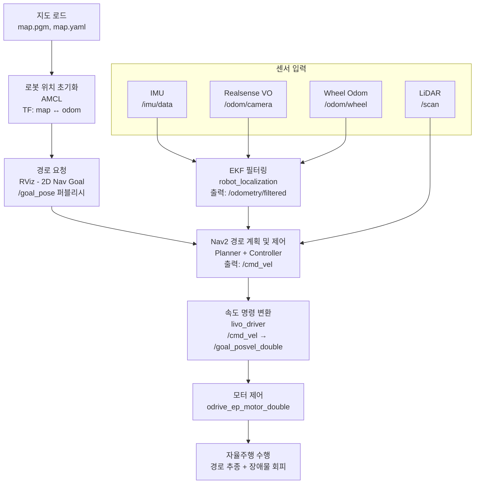

# 1. SLAM

## 1. 실행 명령어

```bash
# 1. Visual Odometry
ros2 launch livo_navigation rtab_color_livo_fixed.launch.py

# 2. 센서 및 기본 오도메트리 실행
ros2 launch livo_bringup livo_odom_fixed.launch.py

# 3. 모터 드라이버 및 조이스틱 제어 노드 실행
ros2 launch odrive_ep_pkg odrive_ep.launch.py
ros2 run joy joy_node

# 4. SLAM 알고리즘 실행
ros2 launch livo_navigation slam_fixed.launch.py rviz:=true sim:=false
```


## 1.2 단계별 설명

1.  **VO 활성화**: `rtab_color_livo_fixed.launch.py`가 실행되어 Realsense 카메라 기반의 Visual Odometry가 활성화된다.
2.  **센서/구동계 활성화**: `livo_odom_fixed.launch.py`가 실행되어 Lidar, Realsense 카메라, IMU 센서 및 모터 엔코더를 이용한 기본 오도메트리 노드(`odom_node_fixed`)가 활성화되고, `/odom/wheel` 토픽으로 오도메트리 정보를 발행한다. EKF 노드는 `/odom/wheel`, `/odom/camera` (Visual Odometry), 그리고 `/imu/data` (IMU)를 입력으로 받아 `/odometry/filtered` 토픽으로 통합된 오도메트리 정보를 발행한다.
3.  **수동 조작 준비**: `joy_node`는 조이스틱 입력을 `/joy` 토픽으로 발행하고, `odrive_ep_pkg`의 `odrive_ep_joy` 노드는 이를 구독하여 모터 제어 명령인 `/goal_posvel_double`로 변환한다. `odrive_ep_motor_double` 노드가 이 명령을 받아 실제 로봇을 움직인다.
4.  **SLAM 실행**: `slam_fixed.launch.py`가 SLAM 알고리즘 노드를 실행한다. 이 노드는 `/scan`, `/imu/data`, `/odometry/filtered` 등 모든 센서 데이터를 구독하여 지도를 생성(`map` 토픽)하고, `map` 프레임과 `odom` 프레임 간의 관계(`tf`)를 지속적으로 계산하여 발행한다.
5.  **지도 작성**: 사용자는 조이스틱으로 로봇을 움직여 환경을 탐색하고, SLAM 노드는 로봇의 이동 경로와 센서 데이터를 바탕으로 지도를 완성해나갑니다. RViz를 통해 이 과정이 시각화된다.

```meramid
---
config:
  flowchart:
    htmlLabels: true
---
flowchart TD
 subgraph subGraph0["센서 입력"]
        S1["LiDAR<br>/scan"]
        S2["IMU<br>/imu/data"]
        S3["Realsense VO<br>/odom/camera"]
        S4["Wheel Odom<br>/odom/wheel"]
  end
    A1["조이스틱 입력"] --> A2["odrive_joy<br>/goal_posvel_double"]
    A2 --> A3["모터 제어 노드<br>odrive_ep_motor_double"]
    S2 --> F1["EKF 필터링<br>(robot_localization)<br>입력: IMU, VO, Wheel<br>출력: /odometry/filtered"] & M1["SLAM<br>입력: /scan, /imu/data, /odometry/filtered<br>출력: /map, /tf (map↔odom)"]
    S3 --> F1
    S4 --> F1
    S1 --> M1
    F1 --> M1
    M1 --> V1["RViz 시각화 및 저장<br>map.pgm / map.yaml"]
```

---

# 2. Navigation

## 2.1 실행 명령어

```bash
# 1. Visual Odometry
ros2 launch livo_navigation rtab_color_livo_fixed.launch.py

# 2. 모터 드라이버 실행
ros2 launch odrive_ep_pkg odrive_ep.launch.py

# 3. 센서 및 기본 오도메트리 실행
ros2 launch livo_bringup livo_odom_fixed.launch.py

# 4. Navigation 스택 실행 (Nav2)
ros2 launch livo_navigation navigation_fixed.launch.py rviz:=true sim:=false
```

## 2.2 단계별 설명

1.  **VO 활성화**: `rtab_color_livo_fixed.launch.py`가 실행되어 Realsense 카메라 기반의 Visual Odometry가 활성화된다.
2.  **기반 시스템 활성화**: `livo_odom_fixed.launch.py`와 `odrive_ep_pkg`가 실행되어 센서와 모터가 준비된다. `livo_odom_fixed.launch.py`는 `/odom/wheel` 토픽으로 오도메트리 정보를 발행하고, EKF 노드는 `/odom/wheel`, `/odom/camera` (Visual Odometry), 그리고 `/imu/data` (IMU)를 입력으로 받아 `/odometry/filtered` 토픽으로 통합된 오도메트리 정보를 발행한다.
3.  **Navigation 스택 실행**: `navigation_fixed.launch.py`가 Nav2 스택을 실행한다. Nav2는 `/odometry/filtered` 토픽을 사용하여 로봇의 위치를 추정하고 경로를 계획한다.
    *   **Map Server**: 미리 생성된 지도를 불러와 `/map` 토픽으로 발행한다.
    *   **Localization (AMCL)**: Lidar(`scan`), IMU, 오도메트리, VO 등 모든 위치 관련 정보를 종합하여, 불러온 지도 위에서 로봇의 현재 위치를 매우 정확하게 추정한다.
    *   **BT Navigator, Planner, Controller**: 사용자가 RViz에서 목표 지점을 설정하면(`goal_pose`), BT Navigator가 경로 계획(Planner)과 경로 추종(Controller)을 총괄하여 로봇의 이동을 제어한다.
4.  **자율 주행**: Controller는 계산된 경로를 따라가기 위해 속도 명령(`cmd_vel`)을 발행한다. `livo_bringup`의 `livo_driver` 노드가 이 `cmd_vel`을 ODrive가 이해할 수 있는 `/goal_posvel_double` 메시지로 변환하여 로봇이 목표 지점까지 자율적으로 이동한다.



---
